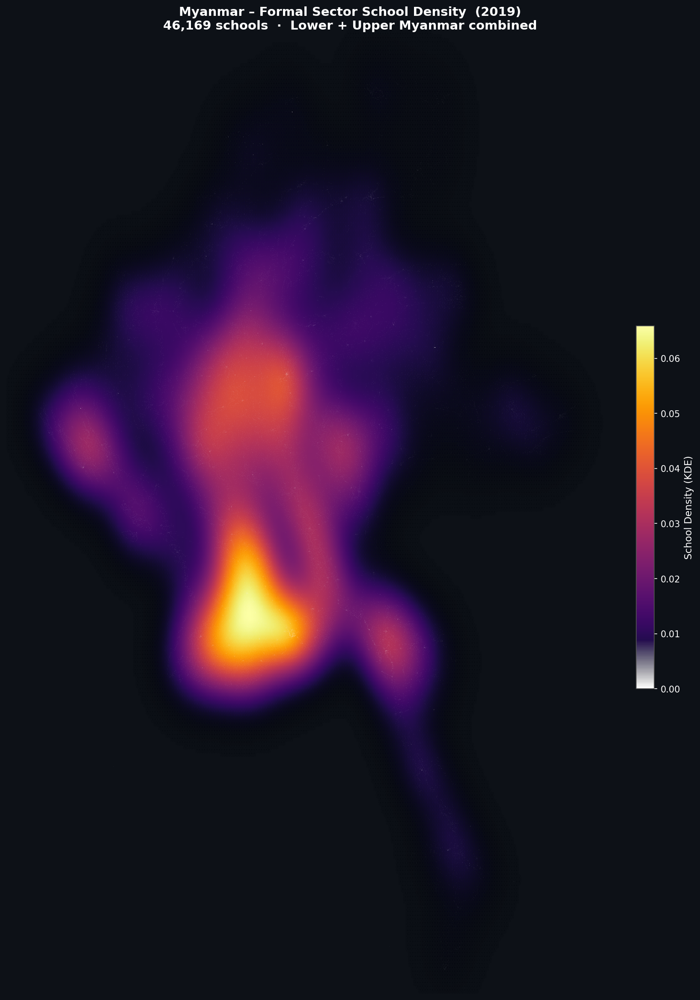
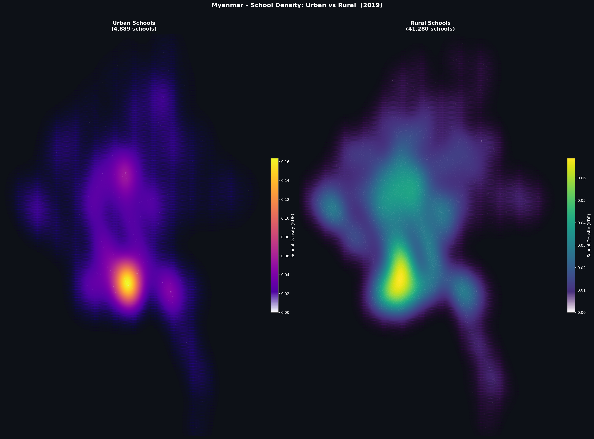

# 🏫 Myanmar Formal Sector School Locations — Heatmap Analysis (2019)

[](https://www.python.org/)
[](https://pandas.pydata.org/)
[](https://python-visualization.github.io/folium/)
[](https://geonode.themimu.info)
[](LICENSE)
[](http://themimu.info/license/)

A geospatial analysis and visualisation project that merges two official MIMU vector datasets of formal-sector school locations across Lower and Upper Myanmar, then produces a suite of density heatmaps — both static (PNG) and interactive (HTML) — to reveal where schools are most and least concentrated across the country's states, regions, and urban/rural divides.

---

## 📸 Preview

| Full Country | By State / Region |
|:---:|:---:|
|  |  |

| Urban vs Rural |
|:---:|
|  |

> **Interactive map:** Open [`heatmap_interactive.html`](heatmap_interactive.html) in any modern browser for a fully zoomable, layer-switchable heatmap with per-school tooltips.

---

## 📋 Table of Contents

1. [Project Overview](#-project-overview)
2. [Data Sources](#-data-sources)
3. [Dataset Schema](#-dataset-schema)
4. [Output Files](#-output-files)
5. [Repository Structure](#-repository-structure)
6. [Installation](#-installation)
7. [Usage](#-usage)
8. [Methodology](#-methodology)
9. [Key Findings](#-key-findings)
10. [Technical Notes](#-technical-notes)
11. [Licenses](#-licenses)
12. [Acknowledgements](#-acknowledgements)

---

## 🗺 Project Overview

Myanmar's Ministry of Education (MoE) verified the locations of all formal-sector basic education schools across the country in 2019. That location data was compiled and published by the **Myanmar Information Management Unit (MIMU)** as two separate geospatial layers on the MIMU GeoNode platform — one covering Lower Myanmar, one covering Upper Myanmar.

This project:

1. **Downloads** both CSV exports from MIMU GeoNode.
2. **Merges** them into a single clean dataset (`merged_schools_myanmar_2019.csv`).
3. **Validates** coordinates, discarding any records with missing or geographically implausible values.
4. **Visualises** school density using 2-D Gaussian Kernel Density Estimation (KDE) overlaid on real map tiles across four publication-ready output files.

The combined dataset covers **46,169 schools** spanning all 14 states and regions of Myanmar.

---

## 📂 Data Sources

Both datasets were downloaded as CSV files from the **MIMU GeoNode** platform hosted at [geonode.themimu.info](https://geonode.themimu.info).

### Lower Myanmar

| Field | Value |
|---|---|
| **Title** | Formal Sector School Location Lower Myanmar (2019) |
| **URL** | https://geonode.themimu.info/layers/geonode%3Aformal_sector_school_location_lowermyanmar_2019 |
| **Owner / Compiler** | MIMU-GIS |
| **Data verified by** | Ministry of Education (MoE) |
| **Verification date** | May 2019 |
| **Published (revision date)** | 16 December 2019 |
| **Abstract** | Formal Sector Schools for Basic Education in Myanmar. Location data was verified in May 2019 by the Ministry of Education (MoE) and compiled by MIMU. |
| **License** | MIMU Data License — http://themimu.info/license/ |
| **Type** | Vector Data |
| **Category** | Structure |
| **Keywords** | infrastructure, formal sector, education, public sector, school, basic education |
| **Language** | English |
| **Records in CSV** | 19,356 |

**Coordinate statistics (Lower Myanmar):**

| Attribute | Average | Median | Std Dev |
|---|---|---|---|
| `longx` (longitude) | 96.18° | 95.88° | 1.09° |
| `laty` (latitude) | 17.05° | 17.00° | 1.41° |

---

### Upper Myanmar

| Field | Value |
|---|---|
| **Title** | Formal Sector School Location Upper Myanmar (2019) |
| **URL** | https://geonode.themimu.info/layers/geonode%3Aformal_sector_school_location_uppermyanmar_2019 |
| **Owner / Compiler** | MIMU-GIS |
| **Data verified by** | Ministry of Education (MoE) |
| **Verification date** | October 2019 |
| **Published (revision date)** | 16 December 2019 |
| **Abstract** | Formal Sector Schools for Basic Education in Myanmar. Location data was verified in October 2019 by the Ministry of Education (MoE) and compiled by MIMU. |
| **License** | MIMU Data License — http://themimu.info/license/ |
| **Type** | Vector Data |
| **Category** | Structure |
| **Keywords** | infrastructure, formal sector, education, public sector, school, basic education |
| **Language** | English |
| **Records in CSV** | 26,813 |

**Coordinate statistics (Upper Myanmar):**

| Attribute | Average | Median | Std Dev |
|---|---|---|---|
| `longx` (longitude) | 95.68° | 95.60° | 1.59° |
| `laty` (latitude) | 21.75° | 21.42° | 1.76° |

---

### Data Limitations

As noted in the supplemental information on both GeoNode pages:

> *"Some school locations have yet to be confirmed and some may not be included in this dataset."*

The data is intended for **operational purposes only** — to support humanitarian and development activities in Myanmar — and should not be treated as a definitive census of all schools.

### Data Restrictions

> MIMU geospatial datasets **cannot be used on an online platform** unless with prior written agreement from MIMU. MIMU products are not for sale and can be used free of charge **with attribution**.

See the full terms at: http://themimu.info/mimu-terms-conditions

---

## 📐 Dataset Schema

Both source files share an identical column structure:

| Column | Type | Description |
|---|---|---|
| `FID` | string | Feature identifier, unique per source file (e.g. `formal_sector_school_location_lowermyanmar_2019.1`) |
| `the_geom` | string | WKT point geometry — `MULTIPOINT ((longitude latitude))` |
| `OBJECTID` | integer | Object identifier, unique per source file |
| `schoolname` | string | School name in Burmese script |
| `urbanrural` | string | Location classification: `Urban` or `Rural` |
| `longx` | float | Longitude in decimal degrees (WGS-84 / EPSG:4326) |
| `laty` | float | Latitude in decimal degrees (WGS-84 / EPSG:4326) |
| `mm_srcode` | string | State/Region code (e.g. `MMR017`) |
| `mm_srname` | string | State/Region name (e.g. `Ayeyarwady`) |
| `mm_dtcode` | string | District code (e.g. `MMR017D004`) |
| `mm_dtname` | string | District name (e.g. `Labutta`) |
| `mm_tscode` | string | Township code (e.g. `MMR017018`) |
| `mm_tsname` | string | Township name (e.g. `Mawlamyinegyun`) |

### Additional columns in the merged output

The script appends two columns when producing `merged_schools_myanmar_2019.csv`:

| Column | Type | Description |
|---|---|---|
| `source_region` | string | Provenance tag: `Lower Myanmar` or `Upper Myanmar` |
| `longitude` | float | Renamed from `longx` for readability |
| `latitude` | float | Renamed from `laty` for readability |

> **Coordinate system:** All source coordinates are geographic (WGS-84, EPSG:4326). The script internally reprojects to Web Mercator (EPSG:3857) via a vectorised NumPy formula for rendering alongside map tiles.

---

## 📦 Output Files

| File | Size (approx.) | Description |
|---|---|---|
| `merged_schools_myanmar_2019.csv` | ~11 MB | Cleaned, merged dataset — 46,169 rows |
| `heatmap_static_full.png` | ~1.6 MB | Full-country KDE density map |
| `heatmap_static_by_region.png` | ~5 MB | Faceted KDE map — one panel per state/region |
| `heatmap_static_urbanrural.png` | ~4 MB | Side-by-side Urban vs Rural density comparison |
| `index.html` | ~4.8 MB | Interactive Folium map (interactive heatmap) with togglable layers |

### `heatmap_static_full.png`

A single full-country view rendered on a **CartoDB Dark Matter** basemap. The KDE surface uses the **inferno** colour scale, which fades to transparent at low density so the underlying basemap shows through. Semi-transparent white dots mark individual school locations beneath the density surface.

### `heatmap_static_by_region.png`

A grid of panels — one per state/region with ≥ 300 schools — each independently scaled to the geographic extent of that administrative unit. This makes within-region cluster patterns visible even for geographically compact states like Yangon.

### `heatmap_static_urbanrural.png`

Two side-by-side panels covering all of Myanmar:
- **Urban** (4,889 schools · 10.6%) — **plasma** colour scale (purple → magenta → white)
- **Rural** (41,280 schools · 89.4%) — **viridis** colour scale (dark blue → teal → yellow)

### `heatmap_interactive.html`

A self-contained HTML file that requires no server — open it directly in any modern browser. Features include:

- **Switchable basemaps:** Dark Matter, CartoDB Positron, OpenStreetMap
- **Toggleable heatmap layers** (top-right panel):
  - All Schools (on by default)
  - Urban Schools Only
  - Rural Schools Only
  - Per state/region layers, each with a unique colour accent
  - 2,000 sampled individual schools as clickable circle markers
- **Per-school tooltips** showing: name, urban/rural type, state/region, district, township, and coordinates
- **Fixed legend** (bottom-left) with colour scale explanation and record counts
- **Title banner** pinned to the top of the map

---

## 🗂 Repository Structure

```
myanmar-school-heatmap/
│
├── formal_sector_school_location_lowermyanmar_2019.csv   # Raw source — Lower Myanmar (MIMU)
├── formal_sector_school_location_uppermyanmar_2019.csv   # Raw source — Upper Myanmar (MIMU)
│
├── school_heatmap.py                                     # Main analysis & visualisation script
├── requirements.txt                                      # Python dependencies
├── .gitignore                                            # Git ignore rules
├── LICENSE                                               # MIT License (code only)
├── README.md                                             # This file
│
├── merged_schools_myanmar_2019.csv                       # Generated — merged dataset
├── heatmap_static_full.png                               # Generated — full-country heatmap
├── heatmap_static_by_region.png                          # Generated — per-region facets
├── heatmap_static_urbanrural.png                         # Generated — urban vs rural
└── heatmap_interactive.html                              # Generated — interactive map
```

> The five generated files are committed to this repository for convenience. To regenerate them from scratch, run `python school_heatmap.py` after installing the dependencies.

---

## ⚙️ Installation

### Prerequisites

- Python **3.10** or newer
- `pip`
- An internet connection (map tiles are fetched from CartoDB during static rendering)

### Steps

**1. Clone the repository**

```bash
git clone https://github.com/<your-username>/myanmar-school-heatmap.git
cd myanmar-school-heatmap
```

**2. Create and activate a virtual environment** *(recommended)*

```bash
# macOS / Linux
python -m venv .venv
source .venv/bin/activate

# Windows
python -m venv .venv
.venv\Scripts\activate
```

**3. Install dependencies**

```bash
pip install -r requirements.txt
```

<details>
<summary>Conda alternative</summary>

```bash
conda create -n myanmar-schools python=3.11
conda activate myanmar-schools
pip install -r requirements.txt
```

</details>

---

## 🚀 Usage

Run the single script from the repository root:

```bash
python school_heatmap.py
```

The script runs through six numbered steps and prints progress to stdout:

```
============================================================
Step 1 – Loading & merging CSV files …
  Lower Myanmar :  19,356 schools
  Upper Myanmar :  26,813 schools
  Merged total  :  46,169 schools
  Saved  →  merged_schools_myanmar_2019.csv

Step 2 – Full-country static heatmap …
  Saved  →  heatmap_static_full.png

Step 3 – Per-region facet heatmap …
  Saved  →  heatmap_static_by_region.png

Step 4 – Urban vs Rural heatmap …
  Saved  →  heatmap_static_urbanrural.png

Step 5 – Interactive Folium heatmap …
  Saved  →  heatmap_interactive.html

============================================================
SUMMARY
...
============================================================
Done.
```

Total runtime is typically **2–4 minutes** on a modern laptop, depending on network latency for tile fetching.

### Viewing the interactive map

```bash
# macOS
open heatmap_interactive.html

# Windows
start heatmap_interactive.html

# Linux
xdg-open heatmap_interactive.html
```

Or drag the file directly into any modern browser (Chrome, Firefox, Edge, Safari).

---

## 🔬 Methodology

### 1. Data Merging

Both MIMU CSV files are loaded with `pandas.read_csv()`. A `source_region` column (`"Lower Myanmar"` / `"Upper Myanmar"`) is appended to each before concatenation so row provenance is preserved. The coordinate columns are renamed (`longx` → `longitude`, `laty` → `latitude`) for readability. Rows are then dropped if they have:

- Null `longitude` or `latitude` values, or
- Coordinates outside Myanmar's geographic bounding box: longitude [92°E, 102°E], latitude [9.5°N, 29°N]

No rows were dropped from either dataset in practice — all 46,169 records carry valid in-bounds coordinates.

### 2. Kernel Density Estimation (KDE)

School density is estimated using a **2-D Gaussian KDE** (`scipy.stats.gaussian_kde`) with Scott's rule for automatic bandwidth selection. The resulting continuous density surface is far more interpretable than a raw scatter plot of 46,000+ points.

Evaluating a KDE at every grid cell is O(n × m) — where *n* is the number of data points and *m* is the number of grid cells — so two optimisations are applied:

| Parameter | Value | Rationale |
|---|---|---|
| KDE fit sample | ≤ 15,000 pts (random, seed 42) | Representative subsample; bandwidth estimated on subsample via Scott's rule |
| Full-country grid | 250 × 250 cells | Sufficient visual fidelity at print resolution |
| Per-region grid | 180 × 180 cells | Smaller geographic extent means less visual loss at lower resolution |

The KDE is fitted in **geographic (lon/lat) space** — a reasonable approximation given Myanmar's relatively compact longitudinal span (~9°).

### 3. Coordinate Projection

Map tiles served by contextily are in **Web Mercator (EPSG:3857)**. Rather than routing every point set through a `GeoDataFrame.to_crs()` call — which is slow at 46k+ points — all projection uses a vectorised NumPy formula applied directly to NumPy arrays:

```
x =  lon × (π / 180) × R
y =  ln( tan(π/4  +  lat × π/360) ) × R
```

where R = 6,378,137 m (WGS-84 semi-major axis). This is mathematically equivalent to PROJ's `+proj=merc +a=6378137` and runs roughly **10–20× faster** than a GeoDataFrame round-trip.

### 4. Colourmap Transparency

Low-density regions of the KDE surface are rendered **transparent** rather than opaque so the basemap remains visible beneath them. The effect is achieved by linearly ramping the alpha channel of the lowest 35 colour-table entries (out of 256) from 0 to 1, creating a smooth fade from fully transparent at near-zero density to fully opaque at peak density.

| Visualisation | Colourmap |
|---|---|
| Full country & per-region | `inferno` |
| Urban schools | `plasma` |
| Rural schools | `viridis` |

### 5. Interactive Map (Folium)

The interactive map is built with **Folium** (a Python wrapper around Leaflet.js). `folium.plugins.HeatMap` is used for the density layers. Each logical grouping — all schools, urban-only, rural-only, and each state/region — is wrapped in a `folium.FeatureGroup` so layers are independently togglable in the browser. A stratified random sample of 2,000 schools is added as `CircleMarker` objects with rich tooltip metadata for point-level exploration.

---

## 📊 Key Findings

### Record counts

| Dataset | Schools |
|---|---|
| Lower Myanmar | 19,356 |
| Upper Myanmar | 26,813 |
| **Total** | **46,169** |

### Urban / Rural split

| Type | Count | Share |
|---|---|---|
| Rural | 41,280 | 89.4% |
| Urban | 4,889 | 10.6% |

### Top 10 states / regions by school count

| Rank | State / Region | Schools |
|---|---|---|
| 1 | Ayeyarwady | 7,032 |
| 2 | Sagaing | 5,212 |
| 3 | Magway | 4,342 |
| 4 | Mandalay | 4,210 |
| 5 | Rakhine | 3,250 |
| 6 | Shan (South) | 2,884 |
| 7 | Yangon | 2,743 |
| 8 | Bago (West) | 2,485 |
| 9 | Shan (North) | 2,384 |
| 10 | Bago (East) | 2,303 |

### Top 10 districts by school count

| Rank | District | Schools |
|---|---|---|
| 1 | Taunggyi | 2,045 |
| 2 | Pathein | 1,783 |
| 3 | Thayarwady | 1,392 |
| 4 | Hinthada | 1,380 |
| 5 | Bago | 1,220 |
| 6 | Pyapon | 1,187 |
| 7 | Magway | 1,186 |
| 8 | Katha | 1,104 |
| 9 | Pyay | 1,093 |
| 10 | Taungoo | 1,083 |

### Spatial observations

- **Irrawaddy Delta concentration:** Ayeyarwady Region's delta network creates the single densest school cluster in the country, visible as the brightest hotspot on the full-country map.
- **River-valley corridors:** Rural schools align tightly with the Irrawaddy, Chindwin, and Sittaung river valleys, reflecting the historical concentration of population and infrastructure along waterways and roads.
- **Yangon urban core:** Despite ranking 7th by total school count, Yangon produces the sharpest urban-density peak — a product of its compact footprint relative to its population.
- **Shan Plateau dispersion:** Shan State's schools (North and South combined) are spread across one of Myanmar's largest administrative areas at comparatively low density, reflecting its mountainous terrain and dispersed rural settlements.
- **Coastal fringe (Rakhine & Tanintharyi):** These coastal regions show a distinctly linear school distribution along the narrow strip of coastal plain between the Arakan Range / Tenasserim Hills and the Andaman Sea.
- **Northern frontier sparsity:** Kachin State and Chin State show the lowest school densities, consistent with their large geographic extent, rugged terrain, and smaller populations.

---

## 🛠 Technical Notes

### Internet connection during rendering

Steps 2–4 fetch **map tiles** from CartoDB's tile CDN via `contextily`. If tiles cannot be reached, a warning is printed and the axes background falls back to a flat dark colour (`#111111`). The script does not crash — it completes with a tile-less dark background.

To switch to a different tile provider, change the `source` argument inside `add_basemap()` in `school_heatmap.py`:

```python
# Example: use OpenStreetMap tiles instead
add_basemap(ax, source=ctx.providers.OpenStreetMap.Mapnik, zoom=6)
```

### Adjusting KDE quality

Two constants near the top of the helper section control the quality/speed trade-off:

```python
KDE_SAMPLE = 15_000   # max points used to *fit* the kernel
KDE_GRID   = 250      # grid resolution per axis (250 × 250 = 62,500 cells)
```

Increasing `KDE_GRID` to `400` produces visibly sharper contours. Increasing `KDE_SAMPLE` to the full dataset size gives a more accurate bandwidth estimate in sparse regions. Both changes increase runtime proportionally.

### Output resolution

Static PNGs are saved at 120–150 DPI (varies per figure). For print-quality output, increase the `dpi` argument in the corresponding `fig.savefig()` call, e.g.:

```python
fig.savefig(OUT_FULL, dpi=300, bbox_inches="tight", facecolor=fig.get_facecolor())
```

### Python version compatibility

| Feature used | Minimum version |
|---|---|
| f-strings | Python 3.6+ |
| `numpy.random.default_rng` | NumPy 1.17+ |
| `matplotlib.colormaps.get_cmap` | Matplotlib 3.7+ |
| `pandas.DataFrame.value_counts` (stable) | pandas 1.1+ |

**Python 3.10+ is recommended** to match the tested environment.

---

## 📄 Licenses

This repository contains two distinct types of content, each governed by a separate license.

### Code — MIT License

The analysis script (`school_heatmap.py`) and all supporting project files are released under the **MIT License**. See [`LICENSE`](LICENSE) for the full text. You are free to use, copy, modify, and distribute the code with attribution.

### Data — MIMU Data License

The two raw CSV files (`formal_sector_school_location_lowermyanmar_2019.csv` and `formal_sector_school_location_uppermyanmar_2019.csv`) and the derived merged file (`merged_schools_myanmar_2019.csv`) are subject to the **MIMU Data License**, which is based on the UN Statistics data license.

Key conditions of the MIMU Data License:

- ✅ Free to use **with attribution** to MIMU.
- ✅ Free to redistribute in non-commercial, humanitarian, and development contexts.
- ❌ **Cannot be used on an online platform** without prior written agreement from MIMU.
- ❌ Not for sale.

Full license text: http://themimu.info/license/  
Full terms and conditions: http://themimu.info/mimu-terms-conditions

> **If you intend to deploy this project to a public web server or embed the data in a live online service, you must obtain prior written permission from MIMU before doing so.**

---

## 🙏 Acknowledgements

- **[MIMU — Myanmar Information Management Unit](https://themimu.info)** — for compiling and publishing the formal-sector school location data on the [MIMU GeoNode platform](https://geonode.themimu.info). MIMU is a joint initiative of UN agencies and NGOs providing geospatial and statistical information management support in Myanmar.
- **Ministry of Education, Myanmar (MoE)** — for verifying school locations in the field during 2019 (Lower Myanmar: May 2019; Upper Myanmar: October 2019).
- **[Folium](https://python-visualization.github.io/folium/)** — Python/Leaflet.js bridge used to build the interactive map.
- **[contextily](https://contextily.readthedocs.io/)** — map tile fetching and basemap rendering for static figures.
- **[SciPy](https://scipy.org/)** — `gaussian_kde` implementation used for density estimation.
- **[CartoDB](https://carto.com/basemaps/)** — Dark Matter and Positron basemap tile sets used in both static and interactive outputs.

- **[GeoNode](http://geonode.org/)** (v2.4.1) — open-source geospatial content management platform powering the MIMU data portal.
